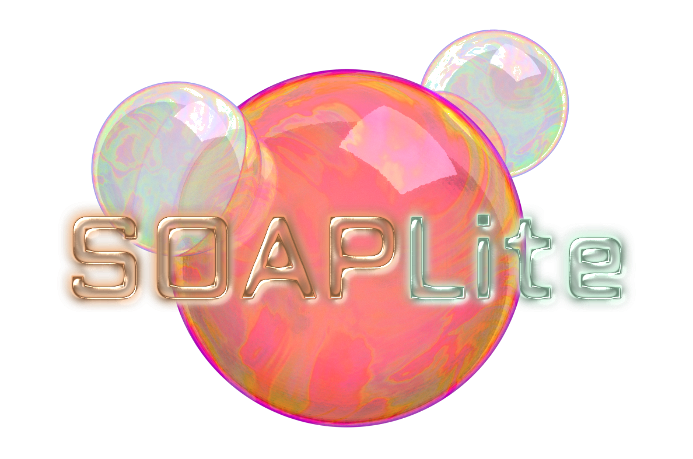

<p align="center">
  
</p>

# SOAPLite

Smooth Overlap of Atomic Positions (SOAP) is an algorithm used for accurately
classifying and machine learning chemical environments [1,2]. For a detailed
documentation, please read soapDoc.pdf in this repository. 

## Getting Started

This is a very lightweight and fast SOAP implementation for machine learning in
quantum chemistry and materials physics. Once you give SOAP the .xyz in ASE
format,  list of positions, radius cutoff, number of basis functions and l
(number of spherical harmonics), SOAP will return a numpy matrix of the power
spectrum for each point. Each row corresponds to each specified point, and each
column corresponds the the spectrum value.

Here is an example of the python interface:
```python
from soaplite import getBasisFunc, get_soap_locals
from ase.build import molecule

#-------------- Define structure -----------------------------------------------
atoms = molecule("H2O")

#-------------- Define positions of desired local environments ----------------
hpos = [
    [0, 1, 2],
    [2, 3, 4]
]

#------------------ Basis function settings (rCut, N_max) ----------------------
n_max = 5
l_max = 5
r_cut = 10.0
my_alphas, my_betas = getBasisFunc(r_cut, n_max)

#--------- Get local chemical environments for each defined position -----------
x = get_soap_locals(
    atoms,
    hpos,
    my_alphas,
    my_betas,
    rCut=r_cut,
    NradBas=n_max,
    Lmax=l_max,
    crossOver=True
)

print(x)
print(x.shape)
```

### Installation

We provide a python interface to the code with precompiled C-extension. This
precompiled version should work with linux-based machines, and can be installed
with:
```
pip install soaplite
```
The pip installation is still experimental for soaplite.

If you wish to use the C-libraries directly, you can compile them yourself by
running
```
make
```
in the terminal after you cloned SOAPLite from github if you have the gcc
compiler.

### Prerequisites

Numpy, Scipy and ASE are required for the python interface. They will be
installed automatically if you use the pip installation. To install them
manully, you can use the following commands:

```
sudo pip install numpy
```
```
sudo pip install scipy
```
and
```
sudo pip install ase
```
If you don't have super user access, install them by
```
pip install numpy --user
```
```
pip install scipy --user
```
and
```
pip install ase --user
```

If you wish to compile the C-extension yourself, you wil need a gcc compiler
for make.

## Running the tests

Enter the tests/ directory and run
```
python test_symmetry.py
```
This will compare the rotational and translational symmetry, and same chemical
environments.

## Possible Applications

By taking the differences of the soap spectrum, we can compare the differences
of the chemical environment. For example, if a point P1 gave a power spectrum
S1 and at point P2 gave  a spectrum S2, the difference of the chemical
environment will be |S2 - S1| where || denotes the Euclidean distance.  We can
use this differences to classify similar/different chemical environments.

The power spectrum can also be used as an input for a neural network, kernel
ridge regression or other machine learning algorithms.

## Authors

* **Eiaki V. Morooka** - [Aki78]( https://github.com/Aki78)
* **Marc Jäger** - [marchunter](https://github.com/marchunter)
* **Lauri Himanen** - [lauri-codes](https://github.com/lauri-codes)

See also the list of contributors who participated in this project.
* **Yu Ninomiya** - [Yu](http://www.sp.u-tokai.ac.jp/~bentz/Members.html)
* **Filippo Federici** - [fullmetalfelix](https://github.com/fullmetalfelix)
* **Yashasvi S. Ranawat** - [yashasvi-ranawat](https://github.com/yashasvi-ranawat)
* **Adam Foster** - [suurimonster](https://github.com/suurimonster)


## License

This project is licensed under the GNU LESSER GENERAL PUBLIC LICENSE - see the [LICENSE.md](LICENSE.md) file for details

## References
* [1] On representing chemical environments  - Albert P. Bartók, Risi Kondor, Gábor Csányi [paper](https://arxiv.org/abs/1209.3140)
* [2] Comparing molecules and solids across structural and alchemical space -  Sandip De, Albert P. Bartók, Gábor Cásnyi, and Michele Ceriotti [paper](https://arxiv.org/pdf/1601.04077.pdf)

